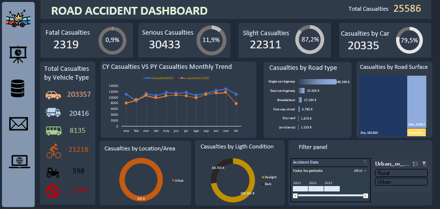

# Road Accident Data Dashboard

## Project Summary

This project, named "Road Accident Data," is a user-friendly dashboard made with Microsoft Excel. It presents important details about road accidents in the United Kingdom. The dashboard makes it easy to understand the data through various views.

## Key Features

- **Easy Navigation**: Move through pages to look at different data and charts.
- **Cleaning Data**: We ensured the data was accurate by cleaning it in Excel.
- **Pivot Tables**: These help summarize data and are used to make graphs.
- **Customizable Filters**: Adjust settings to view specific data you need, like dates or places of accidents.

## Dashboard Components

- **Total Casualties**: Shows all the injuries and breaks them down by vehicle type, severity, and lighting conditions.
- **Accidents by Road Type & Surface**: Shows how road types and conditions affect accident likelihood and severity.
- **Trends Over Time**: Monthly data comparison to spot trends.
- **Accident Locations**: Shows if more accidents happen in cities or rural areas.
- **Filter Panel**: Lets you choose and customize the data display.

## Data Handling

We started by cleaning the data in Excel to make sure it was accurate. Then, we used pivot tables to organize the data, which helped us create the charts.

## Tools Used

- **Microsoft Excel**: All-in-one tool for data storage, cleaning, and analysis.
- **Data Cleaning in Excel**: Special tools in Excel were used to make sure the data was clean and accurate.
- **Pivot Tables & Charts**: For summarizing data and creating easy-to-understand visuals.
- **Excel Formulas & Macros**: Automated some tasks to make the dashboard more interactive.

## Insights

This dashboard does more than just count accidents—it helps us understand the causes and how to possibly prevent them.

## Getting Started

To use this dashboard:

1. Clone this repository to your local machine.
2. Open the `Road_Accident_Data.xlsx` file in Microsoft Excel.
3. Enable macros if prompted, to ensure interactive elements function correctly.
4. Use the navigation menu to view different data perspectives.

## Contact

For any questions or to get in touch, please send an email to [acampagioria@gmail.com](mailto:acampagioria@gmail.com).

---

Thank you for visiting the Road Accident Data Analysis project!
